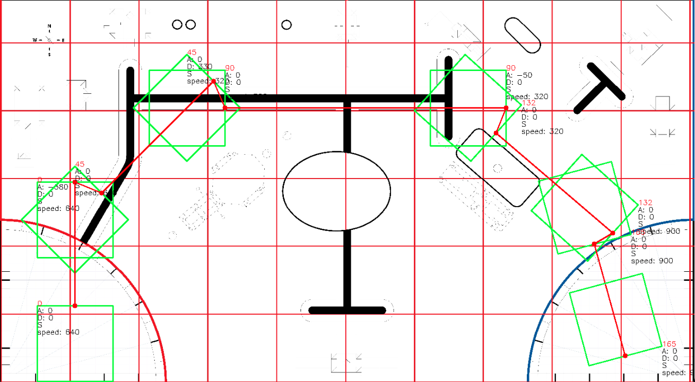
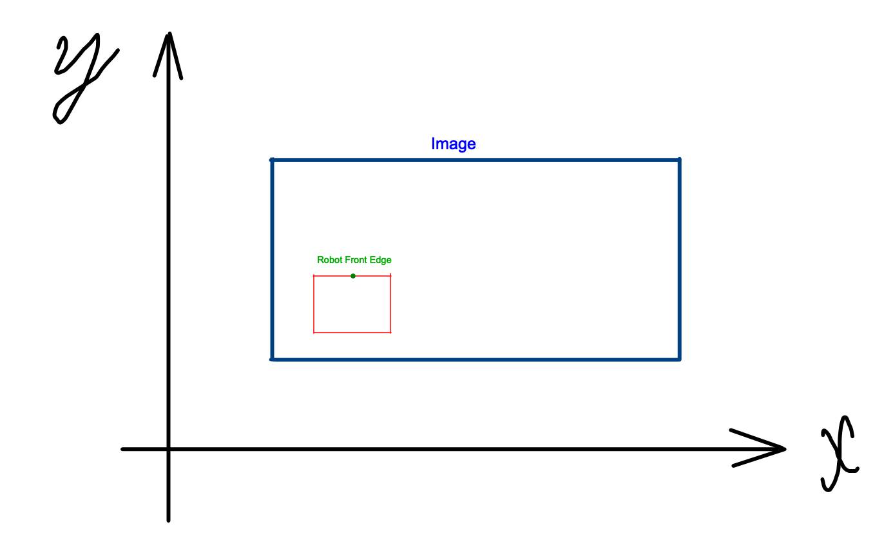

# EV3PathBot

## 📖 Introduction

`EV3PathBot` is a python package that is used to control the `EV3` robot to follow a path, pre-defined by the user.

The motivation for this project is to provide a simple and easy to use control system for the `EV3` community to use in their projects.

The `EV3PathBot` package is developed generates a script that is modifiable by the user to add more functionality to the robot, which saves the user time and effort.

The package is developed using [ev3dev2](https://github.com/ev3dev/ev3dev-lang-python) library.



## ⚒️ Requirements

1- `Python3`
2- `Anaconda` or `Miniconda`
3- `Git bash` for **Windows Users** -*Optional but recommended*-

> ⚠️ **Note:** This package is tested on `Windows` machine. It should work on `Linux` and `Mac` machines as well.


## 💻 Installation

### Unix (Linux & Mac)
#### Creating `Virtual Environment`

by running this command:
```
$ make virenv
```

then activate the virtual environment
```
$ conda activate ev3pathbot-env
```

#### Install & build the package:
```
$ make install
```

### Windows
#### Creating `Virtual Environment`

run these commands in `git bash`:
```
$ conda env create -f environment.yaml
```

then activate the virtual environment
```
$ conda activate ev3pathbot-env
```

#### Install & build the package:
```
$ ./install.bat
```

## 📚 Glossary

- `X` and `Y` are the coordinates of the robot in the `Cartesian` coordinate system. As shown in the figure below:



## ▶️ Usage

> ⚠️ **Note:** you are running the `EV3PathBot` package on python3, and running the generated script on the `microPython` on the `EV3` brick.
Just follow the instructions below.

### 1. Configuring the `EV3` robot and the environment

fill in the `config.yaml` file with the following information:

| Parameter | Description |
| --- | --- |
| `robot dimensions` ||
| `length_x` | The length of the robot in the x-axis in **stud** |
| `width_y` | The width of the robot in the y-axis in **stud**|
| `wheel_diameter` | The robot outer wheel's diameter in **mm** |
| `mat_dimensions` ||
| `length_x ` | The length of the mat or the arena in the x-axis in **mm** |
| `width_y` | The width of the mat or the arena in the y-axis in **mm** |
| `mat_image_path` | The path to the mat image |
| `robot_motors` ||
| `port_A` | Type of the motor connected to port A (Medium or Large)|
| `port_B` | Type of the motor connected to port B (Medium or Large)|
| `port_C` | Type of the motor connected to port C (Medium or Large)|
| `port_D` | Type of the motor connected to port D (Medium or Large)|
| `robot_sensors` ||
| `port_1` | Type of the sensor connected to port 1 (Color or Gyro)|
| `port_2` | Type of the sensor connected to port 2 (Color or Gyro)|
| `port_3` | Type of the sensor connected to port 3 (Color or Gyro)|
| `port_4` | Type of the sensor connected to port 4 (Color or Gyro)|
| `pid_constants` ||
| `kp` | The proportional constant of the PID controller |
| `ki` | The integral constant of the PID controller |
| `kd` | The derivative constant of the PID controller |
| `log_file_append` | to append to the log file or not (True or False) |
| `steps` ||
| `delta_theta` | the rotation angle of the robot in degrees |
| `delta_pixels` | the distance the robot will move in pixels |
| `additional_motors_steps` | the medium motors speed steps in degrees |
| `speed_steps` | the step size of the robot movement speed |

### 2. Connecting the `EV3` robot to the computer

follow the instructions in the [ev3dev2](https://www.ev3dev.org/docs/getting-started/) to install the image on the `EV3` brick, and connect it to the computer.

### 3. Run the `EV3PathBot` package

use the following command to run the package on `mac` or `linux`:
```
$ python src/main.py
```
or use the following command to run the package on `windows`:
```
$ python src\main.py
```
### 4. Follow the control instructions

to control the robot, use the following keys:
| Key | Description |
| --- | --- |
| `w` | move forward |
| `s` | move backward |
| `a` | turn left |
| `d` | turn right |
| `q` | quit the program and generate the script |
| `,` | rotate the robot's head left |
| `.` | rotate the robot's head right |
| `p` | save the robot current position, orientation and speed |
| `z` | increase the additional motors 1 degrees |
| `x` | decrease the additional motors 1 degrees |
| `c` | increase the additional motors 2 degrees |
| `v` | decrease the additional motors 2 degrees |
| `r` | change the additional motors mode to **Parallel** |
| `t` | change the additional motors mode to **Series** |
| `m` | increase the robot movement speed |
| `n` | decrease the robot movement speed |
| `y` | reset the gryo sensor angle value |

> ⚠️ **Note:** Make sure that you are on English keyboard layout.

### 5. Edit the generated script

Now you will have a generated script in the `ev3dev-codes` directory, you can edit it to add more functionality to the robot.

Each time you run the `EV3PathBot` package, it will generate a new script with a new name, so you can keep the old scripts and compare them.

## 🔁 Control System

The `EV3PathBot` package uses a `PID` controller to control the robot movement. The `PID` controller is a closed-loop control system that uses the current error, the integral of the error, and the derivative of the error to calculate the output.

The control function is:
$u(t) = K_pe(t) + K_i \int_0^t e(\tau)d\tau + K_d\frac{de(t)}{d(t)}$

where:
- $K_p$ is the proportional constant
- $K_i$ is the integral constant
- $K_d$ is the derivative constant
- $e(t)$ is the error at time $t$
- $u(t)$ is the output at time $t$


## ✍️ Authors

- Ali Albustami [](https://www.linkedin.com/in/alibustami/) [](https://github.com/alibustami)

- Waleed Abu Blan [](https://www.linkedin.com/in/waleed-abublan-5a2401248/) [](https://github.com/abublan243)

- Hazem Al Btoush [](https://github.com/hazem1488)


## 🙌 Acknowledgments

Big thanks to Zaid Ghazal [](https://www.linkedin.com/in/zaid-ghazal/) for sharing his knowledge and experience with us.

## Contributing

To contribute to `EV3PathBot`, follow these steps:

1. Fork this repository.
2. Create a branch: `git checkout -b <branch_name>`.
3. Make your changes and commit them: `git commit -m '<commit_message>'`
4. Push to the original branch: `git push origin <project_name>/<location>`
5. Create the pull request.


## Contact

If you want to contact me you can reach me at my LinkedIn Account [](https://www.linkedin.com/in/alibustami/)
